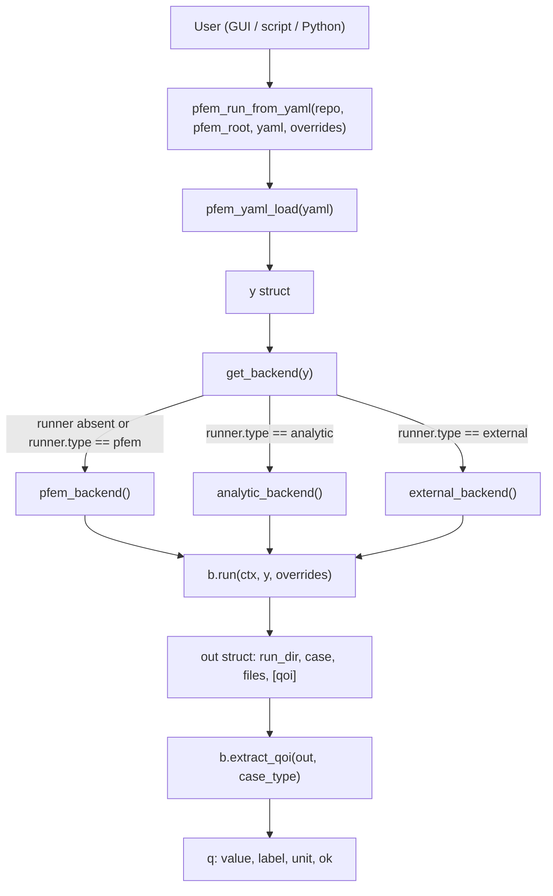
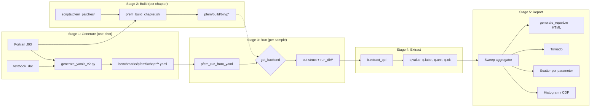
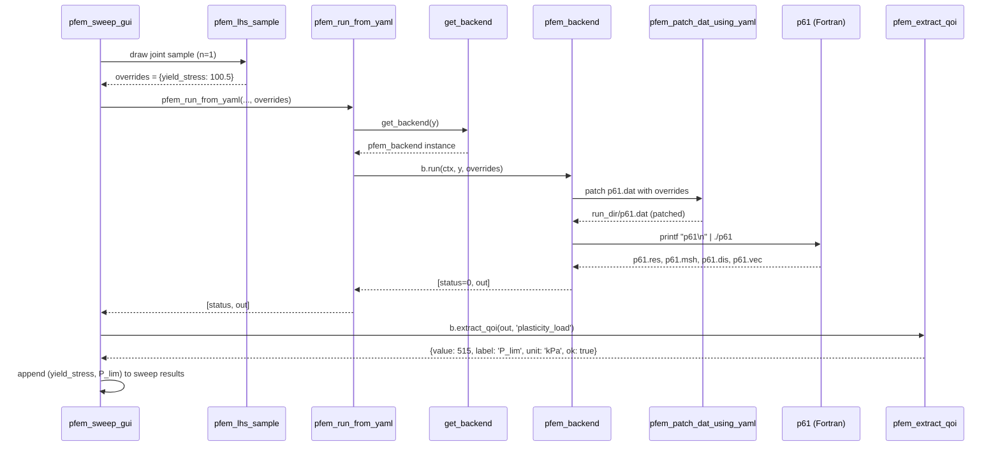

<p align="center">
  
  &nbsp;&nbsp;&nbsp;&nbsp;
  
</p>

<h1 align="center">fem-benchmarks — Architecture</h1>

<p align="center">
  <sub>Companion to <a href="HANDOVER.md">HANDOVER.md</a> · Focuses on <b>how the code fits together</b>.<br>
  Read HANDOVER first for the what-and-why; this doc explains the where-and-how.</sub>
</p>

---

## Table of contents

- [1. One-paragraph summary](#1-one-paragraph-summary)
- [2. Documentation map](#2-documentation-map)
- [3. Runbook: zero to first result](#3-runbook-zero-to-first-result)
- [4. The pipeline: five stages](#4-the-pipeline-five-stages)
- [5. Data flow diagrams](#5-data-flow-diagrams)
- [6. Call graph](#6-call-graph)
- [7. Backend contract (Phase 3)](#7-backend-contract-phase-3)
- [8. Case type registry](#8-case-type-registry)
- [9. Challenges solved (register)](#9-challenges-solved-register)
- [10. Extension points](#10-extension-points)

---

## 1. One-paragraph summary

`fem-benchmarks` takes the 87 stand-alone Fortran programs of the PFEM
textbook and wraps them behind a **single MATLAB entry point**
(`pfem_run_from_yaml`) that dispatches to one of three backends (`pfem`,
`analytic`, `external`) selected by an optional YAML key. Every sweep
mode — Lockstep, Grid, Stochastic (Monte Carlo + LHS + Iman–Conover),
Sensitivity — funnels through the same dispatcher, so a new backend
inherits every mode for free. Four regression gates (`test_golden_qoi`,
`test_all_analytic_oracles`, `test_stochastic_gate`, `test_physics_sanity`)
lock the current behaviour so any future refactor either matches or fails
loudly.

---

## 2. Documentation map

Read in order for a full picture; each doc has a single narrow job.

1. **[HANDOVER.md](HANDOVER.md)** — start here. Everything: history,
   setup, usage, verification, limitations, references.
2. **This file** — technical architecture, call graph, extension points.
3. **[GUIDE.md](GUIDE.md)** — operational usage guide (GUI + API).
4. **[PROGRESS.md](PROGRESS.md)** — supervisor-facing summary of what was
   built when.
5. **[PHASE3_PLAN.md](PHASE3_PLAN.md)** — the plan for the pluggable-runner
   phase, with every milestone marked done.
6. **[adding_a_backend.md](adding_a_backend.md)** — how to add a new
   backend (~30 min).
7. **[adding_an_oracle.md](adding_an_oracle.md)** — how to add a new
   analytic oracle (~15 min).

---

## 3. Runbook: zero to first result

Assuming a fresh Debian/Ubuntu shell:

```bash
# 1. Prereqs
sudo apt install gfortran make python3 python3-pip \
                 libarpack2t64 libarpack2-dev liblapack-dev libblas-dev
pip install pyyaml

# 2. Clone
git clone https://github.com/NZ5253/fem-benchmarks.git
cd fem-benchmarks

# 3. Restore pfem/ (see HANDOVER §12.3 for the two options)

# 4. Build one chapter to sanity-check the toolchain
scripts/pfem_build_chapter.sh ./pfem chap06

# 5. Run every PFEM binary
python3 scripts/run_all_tests.py       # → 87/87 passed

# 6. Fast regression net
matlab -batch "addpath matlab matlab/utils matlab/backends matlab/tests; \
    test_all_analytic_oracles; test_stochastic_gate; test_physics_sanity"

# 7. GUI
matlab -nodesktop -nosplash \
    -r "addpath matlab matlab/utils matlab/backends; pfem_sweep_gui"
```

Total ~10 minutes on a laptop with the PFEM source in place.

---

## 4. The pipeline: five stages

Every user path — CLI, MATLAB script, or GUI — goes through the same five
stages. Only stage 3 (Run) has the backend dispatch; everything else is
independent of which backend is chosen.

### Stage 1 — Generate the YAML catalogue

**One-shot per PFEM case.** [`scripts/generate_yamls_v2.py`](../scripts/generate_yamls_v2.py):

- Parses the Fortran source (`chap06/p61.f03`) for every `READ(10, *) ...`
  statement (handling `&` continuations).
- Tokenises the `.dat` file, preserving positional indices.
- Detects tunable parameters using a symbol table + parameter-family
  heuristic (E, ν, σ_y, c, φ, k, γ, dt, nels, ...).
- Emits YAML at `benchmarks/pfem5/chap06/p61.yaml` with sections
  `authors`, `code`, `fem`, `analysis`, `tunable_parameters`,
  `input_schema`, `inputs`, `outputs`, `how_to_run`, `notes`.

Each `tunable_parameters[*]` records `global_token_index` so the runner
can patch that token directly, no program-specific logic required.

### Stage 2 — Build the Fortran binaries

**Once per chapter, after source changes.** [`scripts/pfem_build_chapter.sh`](../scripts/pfem_build_chapter.sh):

- Walks `pfem/source/chap<N>/`, compiles every `p*.f03` with gfortran.
- Applies the five patches under [`scripts/pfem_patches/`](../scripts/pfem_patches/)
  as needed:
  - `p42`, `p44`: missing `USE geom` → SIGSEGV in `formnf` without it
  - `p57`: allocate UMAT arrays (statev, stran, drot, dfgrd0/1)
  - new library files `elap_time.f03`, `umat_elastic.f03`, `lancz.f03`
  - `p104` needs `-larpack` (via `libarpack2-dev`)
- Binaries land at `pfem/build/bin/p<N>`.

`pfem_ensure_built.m` invokes this script on demand from MATLAB whenever a
binary is missing.

### Stage 3 — Run a case (backend dispatch)

**Every sample of every sweep.** [`matlab/pfem_run_from_yaml.m`](../matlab/pfem_run_from_yaml.m)
is a 30-line dispatcher since Phase 3 M1:

```matlab
function [status, out] = pfem_run_from_yaml(repo_root, pfem_root, yaml_path, overrides)
    if nargin < 4, overrides = struct(); end
    y   = pfem_yaml_load(yaml_path);
    b   = get_backend(y);
    ctx = struct('repo_root', repo_root, ...
                 'pfem_root', pfem_root, ...
                 'yaml_path', yaml_path);
    [status, out] = b.run(ctx, y, overrides);
end
```

[`get_backend`](../matlab/backends/get_backend.m) reads the optional YAML
key `runner.type` and returns one of:

- [`pfem_backend`](../matlab/backends/pfem_backend.m) (default) —
  copies `.dat` into `runs/<chap>/<case>/<key>/`, token-patches parameters,
  ensures binary, runs it, caches baseline `.res`.
- [`analytic_backend`](../matlab/backends/analytic_backend.m) — evaluates
  a closed-form formula in MATLAB memory, persists `results.mat` and
  `run_info.txt` for GUI compatibility.
- [`external_backend`](../matlab/backends/external_backend.m) — writes a
  substituted input file, shells out via `system()`, regex-parses the
  output file.

### Stage 4 — Extract the QoI

**Immediately after each run.** `b.extract_qoi(out, case_type)`:

- PFEM path: dispatches on `case_type` (from
  [`pfem_detect_case_type.m`](../matlab/utils/pfem_detect_case_type.m)) to
  one of eight per-type extractors in
  [`pfem_extract_qoi.m`](../matlab/utils/pfem_extract_qoi.m).
- Analytic / External path: passthrough returning `out.qoi` already
  populated by the backend.

Result struct: `{value, label, unit, ok}` (plus `f1` for eigenvalue).

### Stage 5 — Analyse and report

Sweep-mode-specific:

- **Lockstep / Grid** → [`pfem_plot_sweep_summary.m`](../matlab/utils/pfem_plot_sweep_summary.m)
  emits up to 7 figure windows per case: load–displacement, mesh,
  deformed shape, displacement vectors, EnSight 3D (raw / progressive /
  zones).
- **Stochastic** → in-line histograms + CDFs + per-parameter scatter
  written to `runs/<chap>/<case>/<case>_stochastic_<ts>_*`. Slope cases
  additionally get `P(FS < 1)` and `β = −√2 · erfinv(2·Pf − 1)`.
- **Sensitivity** → [`pfem_plot_tornado.m`](../matlab/utils/pfem_plot_tornado.m)
  draws a horizontal bar chart from `pfem_sensitivity_oat` results.
- **Report** → [`generate_report.m`](../matlab/utils/generate_report.m)
  builds a self-contained HTML file with every PNG embedded as base64.

---

## 5. Data flow diagrams

### The dispatcher tree



### The five-stage pipeline



### Lifecycle of a single stochastic sample (PFEM backend)



---

## 6. Call graph

Verified against the current source. Indentation = "calls".

```
ENTRY POINTS
│
├── pfem_sweep_gui.m ...................... GUI (four modes)
│   │
│   ├── pfem_yaml_load ..................... load YAML → struct
│   ├── get_backend ........................ backend factory
│   ├── pfem_lhs_sample .................... Stochastic: LHS + Iman-Conover
│   ├── pfem_sample_distribution ........... Stochastic: IID fallback
│   ├── pfem_sensitivity_oat ............... Sensitivity: 2k+1 runs
│   │   ├── pfem_run_from_yaml
│   │   ├── get_backend
│   │   └── b.extract_qoi
│   ├── pfem_ensure_built .................. auto-build binary
│   ├── pfem_run_from_yaml ................. THE run choke point
│   ├── pfem_detect_case_type
│   ├── b.extract_qoi (backend-dispatched since Phase 3)
│   ├── plot_stochastic_gui ................ histogram + CDF + scatter
│   ├── pfem_plot_sweep_summary
│   └── pfem_plot_tornado
│
├── NZ.m .................................. scripted multi-case sweep
│   ├── pfem_make_scenarios
│   ├── pfem_ensure_built
│   ├── pfem_run_from_yaml
│   ├── pfem_compare_results
│   └── pfem_plot_sweep_summary
│
├── pfem_stochastic_sweep.m ............... scripted MC (CLI-style)
│
└── scripts/run_all_tests.py .............. Python smoke test (all 87)

THE RUN CHOKE POINT (Phase 3: backend-dispatched)
│
pfem_run_from_yaml(repo_root, pfem_root, yaml_path, overrides)
   ├── pfem_yaml_load(yaml_path)
   ├── get_backend(y)
   │      ├── runner absent / 'pfem'   → pfem_backend
   │      ├── 'analytic'               → analytic_backend
   │      └── 'external'               → external_backend
   └── b.run(ctx, y, overrides)
          │
          ├── PFEM path (pfem_backend)
          │      ├── pfem_patch_dat_using_yaml
          │      ├── pfem_ensure_built
          │      │      └── pfem_build_chapter.sh
          │      ├── system("printf DATASET | ./PROG") → Fortran binary
          │      └── generate_baseline_run (if book .res absent)
          │
          ├── Analytic path (analytic_backend)
          │      └── eval_model('prandtl_bearing' | ... | 'infinite_slope')
          │
          └── External path (external_backend)
                 ├── read + substitute input_template
                 ├── system(runner.command)   → any executable
                 └── regexp on output_file

THE QoI DISPATCHER (PFEM backend only; analytic/external return out.qoi)
│
pfem_extract_qoi(out, case_type)
   ├── qoi_slope_srf ............... FS (last converged SRF)
   ├── qoi_plasticity_load ......... P_lim
   ├── qoi_elastic_static .......... u_max
   ├── qoi_seepage_steady .......... h_max
   ├── qoi_consolidation ........... Uav_end
   ├── qoi_eigenvalue .............. omega^2 (+ derived f1 in Hz)
   ├── qoi_dynamic_transient ....... u_peak
   ├── qoi_thermal ................. T_max
   └── qoi_generic_fallback ........ widest numeric table
```

---

## 7. Backend contract (Phase 3)

The heart of the pluggable design. Every backend implements the same four
fields:

```matlab
b.name           = 'pfem' | 'analytic' | 'external' | <your_name>
b.run            = @(ctx, y, overrides) -> [status, out]
b.extract_qoi    = @(out, case_type)    -> qoi_struct
b.non_sampleable = @(y)                 -> cell of param names to ban
```

Where:

| Symbol | Contents |
|---|---|
| `ctx` | struct with `repo_root`, `pfem_root`, `yaml_path` |
| `y` | loaded YAML struct |
| `overrides` | struct `{param_name → value}` |
| `status` | 0 on success, non-zero on failure |
| `out` | struct with at least `run_dir`, `case`, `files` |
| `qoi_struct` | `{value: double, label: char, unit: char, ok: bool}` |

Rules:

- `run` **must** create `out.run_dir` and populate `out.files` even on
  failure, so the reporter can find something to show.
- `extract_qoi` **must not** throw. Return `q.ok = false` and
  `q.value = NaN` on any parse failure.
- `non_sampleable` **must** be deterministic and cheap. Called once per
  loaded YAML in the GUI to build the union ban list.

For backends that produce the QoI directly (analytic, external), set
`b.extract_qoi = @(out, ~) out.qoi;` and populate `out.qoi` inside `run`.

Detailed tutorial: [adding_a_backend.md](adding_a_backend.md).

---

## 8. Case type registry

`pfem_detect_case_type(y)` maps every YAML to exactly one of eight case
types by chapter + program name, with fallback to
`analysis.physics / analysis.regime`:

| Case type | Chapter → programs | QoI | Extractor gotcha (§9) |
|---|---|---|---|
| `slope_srf` | 6 → p64-p69, p612, p613 | FS | Q5 (p69 free-text) |
| `plasticity_load` | 4 → p45; 6 → p61-p63, p610, p611; 9 → p96; 11 → p118 | P_lim | Q2, Q3, Q4 |
| `elastic_static` | 4 → p41-p46; 5 → all; 9 → p93-p95 | u_max | – |
| `seepage_steady` | 7 → p71-p75 | h_max | Q1 |
| `consolidation` | 8 → p81-p88; 9 → p91-p92 | Uav_end | Q1 |
| `eigenvalue` | 10 → p101-p104 | omega^2 (f1 derived) | S8 (relabel done) |
| `dynamic_transient` | 4 → p47; 7 → p73; 8 → p810 etc; 11 → all | u_peak | – |
| `thermal` | 8 → p811 | T_max | – |
| **Total** | | **87 cases** | |

Total per case-type × totals sum to 87 (verified in
`test_golden_qoi.m`).

---

## 9. Challenges solved (register)

Consolidated from the actual work; each entry is a real problem that cost
time. Keep this list so the next person doesn't rediscover them.

### Build / Fortran (Stage 2)

- **B1. `formnf` SIGSEGV in p42, p44.** Assumed-shape arrays without
  interface. Fix: `USE geom`. See `scripts/pfem_patches/`.
- **B2. Unallocated UMAT arrays in p57.** Fix: allocate.
- **B3. Missing timer / interface in p57.** Fix: `elap_time.f03` +
  interface in `main_int.f03`.
- **B4. Missing Lanczos in p103.** 4th-ed library routine dropped in 5th.
  Fix: `lancz.f03`.
- **B5. ARPACK in p104.** Needs `libarpack2-dev`; build script links it.
- **B6. Wrong dataset for p56.** Textbook `.dat` is the small one; the
  huge 20×60×40 mesh in `executable/` is a different benchmark.

### Run plumbing (Stage 3)

- **R1. program ≠ dataset.** Multi-case programs (p41 with datasets
  p41_1, p41_2) run the program while feeding the dataset name on stdin.
- **R2. Build exit code is unreliable.** A chapter build can exit
  non-zero because a *sibling* program failed. `pfem_ensure_built` checks
  for the binary file, not the exit code.
- **R3. Missing book `.res`.** Some cases (e.g. p63) ship no precomputed
  result. `generate_baseline_run` creates and caches one on first use.
- **R4. Integer parameter patching.** Changing `load_increments`
  regenerates the dependent `qinc` increment array; not a token swap.

### QoI extraction (Stage 4) — `.res` file quirks

- **Q1. Multi-block files.** Time history + depth profile in one
  file. `read_widest_numeric_table` picks the largest block tagged
  with a time-axis header.
- **Q2. Split time-history blocks (p95, p96_1, p96_2).** 5-column t=0 row
  then 6-column t>0 rows. Fixed to pick the largest tagged block.
- **Q3. Multi-word headers (p611, p63).** "dev stress", "pore press" need
  merging before tokenisation.
- **Q4. p118.** 4 columns (time / load / x-disp / y-disp), no iterations.
- **Q5. p69 embankment lift.** Free-text output ("Max displacement is X")
  handled by regex fallback.
- **Q6. MATLAB `\b` regex bug.** `regexp(s, '^\s*time\b', 'once')`
  returns 0 even when `s` starts with "time". Use `(\s|$)` after `^\s*`.

### Stochastic / sensitivity (Stage 5)

- **S7. Never sample solver / mesh parameters.** Sampling
  `convergence_tolerance`, `iteration_limit`, `nels/nxe`, `time_step`
  etc. crashes Fortran (integer-read) or diverges the solver. Since
  Phase 3 M5 the ban list lives on `pfem_backend.non_sampleable` and is
  enforced by `is_non_sampleable(fig, pname)` in the GUI, which unions
  each loaded case's list. Analytic and external contribute empty lists.
- **S8. Eigenvalue label (p101, resolved 2026-05-27).** The chap10
  `bandred` + `bisect` on `M^(-1/2) K M^(-1/2)` returns `omega^2`
  directly. Earlier note claimed `1/omega^2`; that was a misdiagnosis.
  QoI now labelled `omega^2` (unit `rad^2/s^2`) with derived `f1` in Hz.
- **S9. LHS marginals vs correlation.** Iman-Conover restricted pairing
  induces the target rank correlation while preserving each LHS
  marginal exactly. Verified for targets in `[-0.7, +0.5]` within 5 %.

### MATLAB structural

- **M10. Nested vs local functions.** Nested functions require the outer
  function to end with `end`. Prefer top-level local functions in the
  same file.
- **M11. Old uitable.** Doesn't accept `FontColor` / `BackgroundColor` /
  `RowName`; worked around.
- **M12. Function bytecode cache.** MATLAB caches functions when first
  invoked; editing the .m file doesn't reload. Symptom of "my fix didn't
  work". Cure: `close all; clear functions;` or quit + relaunch.
- **M13. `pfem_sweep_gui` hardcoded ~/projects/fem-benchmarks (lowercase)**
  broke on `~/Projects/...` (uppercase). Since `f2a624b` the repo root is
  auto-derived from `mfilename('fullpath')`.

### Phase 3 pluggable-runner specifics

- **P14. `refresh_params` dropped tunables silently.** Fetched
  `y.authors.source.chapter` upfront; non-PFEM YAMLs don't have that
  field, so the wrapping try/catch swallowed the whole YAML. Fixed in
  `159aad8` with a defensive `yaml_chapter_label` helper.
- **P15. Non-PFEM YAML crashed cb_run_stochastic at pre-build.** Fixed
  in `dce6de5` by guarding the build step with `strcmp(b.name, 'pfem')`.
- **P16. `out.elapsed_sec` was PFEM-specific.** Fixed in `2a302b8` with
  defensive `isfield` check.
- **P17. LaTeX interpreter chokes on `omega^2`, underscores in case
  names.** Fixed in `3b87787` by switching titles/axis labels to
  `Interpreter='none'` while keeping LaTeX only for the statistics
  annotation.
- **P18. Locale-dependent decimal separator broke external bash
  solver.** German system printed `514,159` which the parser rejected.
  Fixed in `b78f5f7` by forcing `LC_ALL=C` in `prandtl.sh`.

---

## 10. Extension points

Concrete places where the framework was designed to be extended.

| Extension | Where | Effort | Instructions |
|---|---|---|---|
| Add a new backend | `matlab/backends/<name>_backend.m` + case in `get_backend.m` | ~30 min | [adding_a_backend.md](adding_a_backend.md) |
| Add a new analytic oracle | new `case` in `analytic_backend.m::eval_model` + YAML | ~15 min | [adding_an_oracle.md](adding_an_oracle.md) |
| Add a new external solver | new `benchmarks/external/*.yaml` + solver executable + input template | ~15 min | Copy the `prandtl_bash.yaml` / `prandtl_external.yaml` pattern |
| Add a new case type | new `case` in `pfem_detect_case_type.m` + new extractor in `pfem_extract_qoi.m` | ~1 h | Follow the `qoi_thermal` example (simplest extractor) |
| Add a new sweep mode | new `case` in `pfem_sweep_gui.m` mode dropdown + new callback | ~2 h | Follow the sensitivity callback pattern |
| Add a probe-node QoI | new YAML field `qoi_probe_node`, extend `pfem_extract_qoi.m` to prefer that node when present | ~2 h | See HANDOVER §18 item 1 (BC-bound QoIs) |
| Add mesh-refinement sweep (Phase 4) | new sweep mode that bypasses `non_sampleable` for `nxe`/`nye` | ~half day | See HANDOVER §19 F1 |

For every extension, add at minimum:

- A regression test — either extend an existing one or write a new
  `test_<name>.m`.
- A monotonicity row in `test_physics_sanity.m` if a new tunable is
  introduced.
- A row in `test_all_cases_stochastic.m` if a new case is introduced.

---

<p align="center"><sub>
  <a href="https://github.com/NZ5253/fem-benchmarks">github.com/NZ5253/fem-benchmarks</a> ·
  Companion to <a href="HANDOVER.md">HANDOVER.md</a> ·
  Naeem Zainuddin, Technische Universität Dortmund
</sub></p>
