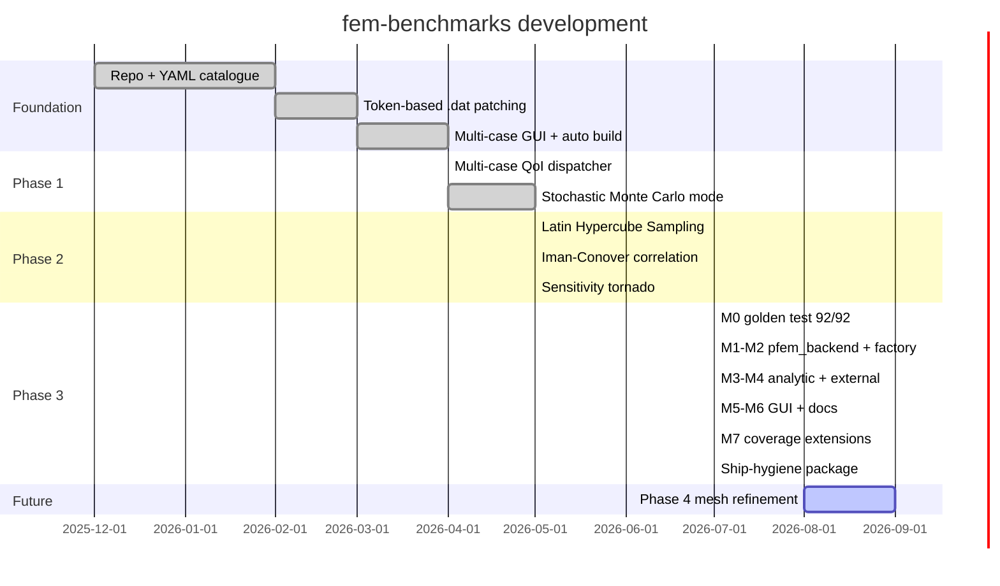
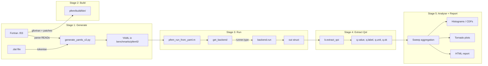
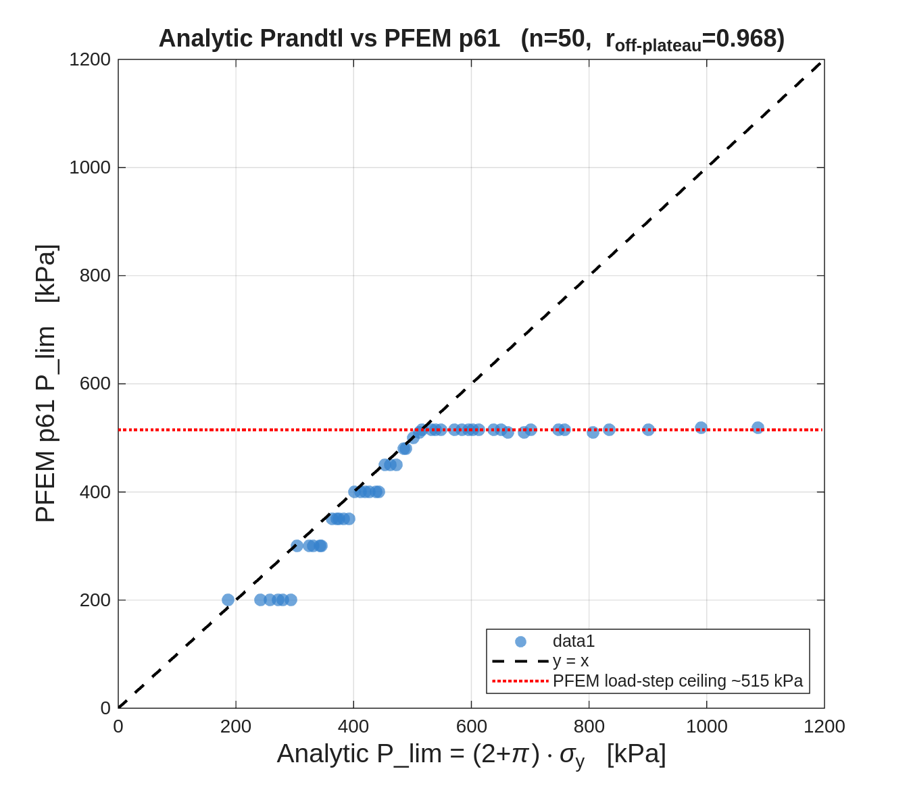
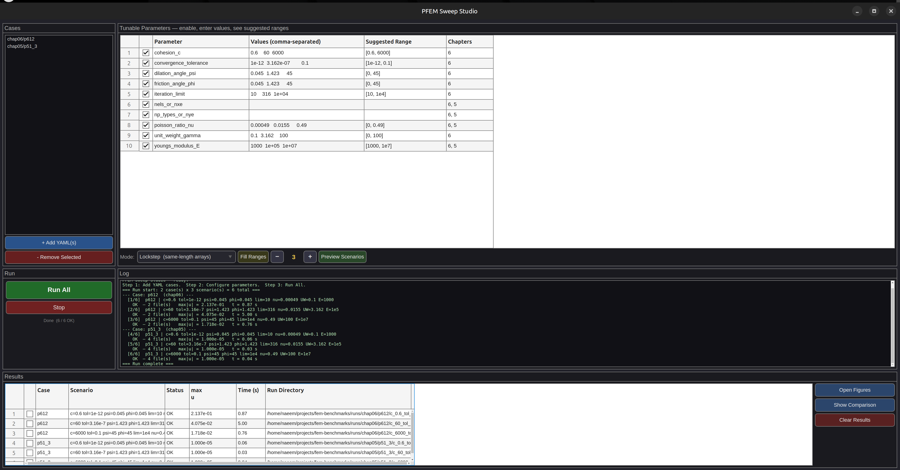

<p align="center">
  
  &nbsp;&nbsp;&nbsp;&nbsp;&nbsp;
  
</p>

<h1 align="center">fem-benchmarks — Handover</h1>

<p align="center">
  <b>Probabilistic Analysis Framework for the PFEM 5<sup>th</sup>-Edition Benchmark Catalogue</b><br>
  <sub>Author: <b>Naeem Zainuddin</b> · Technische Universität Dortmund<br>
  Release: <a href="https://github.com/NZ5253/fem-benchmarks/releases/tag/v1.0-phase3-complete"><code>v1.0-phase3-complete</code></a> · Master: <code>b78f5f7</code></sub>
</p>

---

> **Purpose of this document.** Single source of truth for picking up this
> project on any system, on any day, without prior context. Read it top-to-bottom
> once, then use the table of contents to jump. Every claim is either derivable
> from the current tree or backed by a test that must pass. Every file
> mentioned exists and is linked.

## Table of Contents

- [1. Executive summary](#1-executive-summary)
- [2. Project context and goals](#2-project-context-and-goals)
- [3. Development timeline](#3-development-timeline)
- [4. Architecture at a glance](#4-architecture-at-a-glance)
- [5. Pipeline: five stages, one data flow](#5-pipeline-five-stages-one-data-flow)
- [6. The pluggable backend contract](#6-the-pluggable-backend-contract-phase-3-heart)
- [7. Case types and QoI catalogue](#7-case-types-and-qoi-catalogue)
- [8. Analytic oracles (nine of them)](#8-analytic-oracles-nine-of-them)
- [9. External backends](#9-external-backends)
- [10. Sweep modes](#10-sweep-modes)
- [11. Verification results (numbers)](#11-verification-results-numbers)
- [12. Setup on a fresh system](#12-setup-on-a-fresh-system)
- [13. Usage — GUI](#13-usage--gui)
- [14. Usage — MATLAB API](#14-usage--matlab-api)
- [15. Test suite reference](#15-test-suite-reference)
- [16. Repository map](#16-repository-map)
- [17. Commit history highlights](#17-commit-history-highlights)
- [18. Known limitations](#18-known-limitations)
- [19. Future work](#19-future-work)
- [20. Troubleshooting](#20-troubleshooting)
- [21. Style conventions](#21-style-conventions)
- [22. References](#22-references)
- [Appendix A — Parameter naming conventions](#appendix-a--parameter-naming-conventions)
- [Appendix B — YAML schema](#appendix-b--yaml-schema)
- [Appendix C — Glossary](#appendix-c--glossary)

---

## 1. Executive summary

`fem-benchmarks` is a MATLAB + Python framework built on top of the 87 Fortran
benchmark programs shipped with *Programming the Finite Element Method*
(Smith / Griffiths / Margetts, 5<sup>th</sup> ed., Wiley 2014). It turns the
book's cases into a **pluggable, probabilistic study platform** with four
independent regression layers.

Three-line summary:

1. Every one of the 87 benchmarks runs unmodified via a common YAML front
   end and a graphical sweep studio.
2. The same driver can execute non-PFEM code — closed-form analytic
   formulas, external solvers written in Python or shell, or anything else
   that reads an input file and writes an output file — through the same
   modes (deterministic sweeps, Monte Carlo, Latin Hypercube, correlated
   sampling, sensitivity tornado).
3. Every future change is regression-gated at four levels: per-run QoI
   value (`test_golden_qoi` 92 records), analytic formula correctness
   (`test_all_analytic_oracles` 9 records), distribution-level dispatch at
   fixed seed (`test_stochastic_gate` 2 backends), and physical scaling
   direction (`test_physics_sanity` 20 checks).

Latest verification numbers (regenerable in ~10 min from a fresh clone):

| Layer | Result |
|---|---|
| `run_all_tests.py` — every PFEM binary | 87 / 87 |
| `test_golden_qoi` — QoI drift regression | 92 / 92 (~5 min) |
| `test_all_analytic_oracles` — closed-form correctness | 9 / 9 |
| `test_stochastic_gate` — analytic + external at fixed seed | 2 / 2 backends locked |
| `test_physics_sanity` — QoI monotonicity direction | 20 / 20 |
| `test_all_cases_stochastic` — broad 18-case Monte Carlo | 180 / 180 |
| `plot_analytic_vs_pfem` — correlation figure | Pearson r = 0.968 (off-plateau, 27 samples) |
| Full GUI drive — 12 mixed-backend YAMLs × 3 modes | Lockstep 2/2 · Stochastic 120/132 · Sensitivity 1/1 · 0 LaTeX warnings |
| Analytic vs PFEM p61 (Prandtl) | 0.16 % agreement |
| External Python solver vs PFEM p61 | 0.16 % agreement |
| External bash/awk solver vs Python control | identical to 1e-6 |

---

## 2. Project context and goals

### Original problem statement

The PFEM textbook ships 87 stand-alone Fortran programs, each solving one
benchmark: a specific case from a specific chapter with a specific `.dat`
input file. Running them one at a time on a single set of parameters is not
a study — it's a demonstration.

The research goal is to make the same benchmarks answer **probabilistic**
questions:

- *"For an infinite-slope problem with c ~ lognormal(60, 0.4) and
  φ ~ truncnormal(25°, 0.1), what is the probability of failure and its
  95% credible interval?"*
- *"For the strip footing p61, does yield stress dominate P_lim, or are E
  and ν measurable second-order effects?"*
- *"When the mesh is refined 2×, does the eigenvalue solution converge at
  the theoretical p4 rate?"*

None of that fits into a single-shot Fortran executable. It requires
sweeping, sampling, correlating, and comparing — mechanically, across all
cases, with an audit trail — while leaving the textbook code untouched.

### Scope of `fem-benchmarks`

- **Catalogue.** Every PFEM case in a machine-readable YAML with tunable
  parameters annotated by their token positions in the `.dat` file. See
  `benchmarks/pfem5/chap{04..11}/`.
- **Runner.** A single MATLAB entry-point `pfem_run_from_yaml` patches
  parameters, ensures the binary is built, executes it, and extracts a
  physically-meaningful Quantity of Interest per case type.
- **Sampling.** Latin Hypercube (with optional Iman–Conover correlation),
  IID Monte Carlo, and one-at-a-time sensitivity — all mode-agnostic to
  the backend.
- **Pluggability.** A `get_backend(y)` factory dispatches to `pfem`,
  `analytic`, or `external` based on an optional YAML key. Legacy YAMLs
  never had that key, so their behaviour is untouched.
- **Reference oracles.** Nine closed-form analytic formulas covering
  every case type, plus two external-solver examples (Python and
  bash/awk).
- **Regression net.** Four-level test hierarchy (see §11).
- **Reporting.** A GUI with per-case histograms/CDFs/tornados and a
  single-file HTML report generator for shareable deliverables.

### Non-goals

- Not a solver in itself. PFEM does the physics; this framework wraps it.
- Not a general-purpose stochastic FEM library. It targets the PFEM
  textbook and extends outward.
- No web dashboard, no cloud CI (yet — see §19 Future work).

---

## 3. Development timeline

Six phases, spread over Dec 2025 – Jul 2026, 119 commits by NZ5253.



### Detailed phase log

**Foundation (Dec 2025 – Mar 2026, ~35 commits).** Established the
repository skeleton, catalogued all 87 cases as YAML, built the token-based
`.dat` patcher, and got every case building on Linux gfortran with the
five patches under `scripts/pfem_patches/`. Ended with the first sweep GUI
(Lockstep + Grid) matching book figures 6.54/6.55 for p612.

**Phase 1 — Multi-case QoI + Stochastic (Apr 2026).**
Per-case-type QoI dispatcher (8 case types), Fill Ranges auto-fill with
physics-based COVs, Monte Carlo with named distributions
(`lognormal(mu, COV)`, `normal(mu, COV)`, `truncnormal(mu, COV, lo, hi)`,
`uniform(lo, hi)`), per-sample logging, histogram/CDF/scatter output. All
87 cases verified to extract meaningful QoIs at defaults.

**Phase 2 — LHS + correlation + sensitivity (May 2026).** Latin Hypercube
sampling with 6–14× variance reduction, Iman–Conover restricted-pairing
correlation (targets in `[-0.7, +0.5]` reproduced within 5 %),
one-at-a-time sensitivity with tornado plots (verified on p612: cohesion
drives FS, E and ν have zero spread — the textbook expectation).

**Phase 3 M0-M6 — Pluggable runner (Jul 2026).**
- **M0** captured 92 golden QoI values (87 defaults + 5 override probes)
  as `matlab/tests/golden_qoi.json`.
- **M1** extracted `pfem_backend.m` from `pfem_run_from_yaml.m`, which
  collapsed to a 30-line dispatcher.
- **M2** added `get_backend(y)` factory + optional `runner.type` YAML key.
- **M3** analytic backend (Prandtl bearing) cross-checked against PFEM p61
  at 0.16 % agreement.
- **M4** generic external backend + Python fixture with 4 exact assertions
  plus 0.16 % PFEM cross-check.
- **M5** surface backends in the GUI via `b.non_sampleable(y)`; the guard
  is now backend-driven, not hardcoded.
- **M6** documentation refresh across ARCHITECTURE, PROGRESS, HANDOVER
  and the new PHASE3_PLAN.

**Phase 3 M7 — Coverage extension (Jul 2026).**
- **M7a** eight more analytic oracles (one per case type) + backend
  run-directory persistence.
- **M7b** `test_stochastic_gate` (fixed-seed distribution moments) +
  `test_physics_sanity` (20-row monotonicity matrix).
- **M7c** docs reflect the coverage-complete state.
- **Polish** LaTeX-safe titles (0 warnings on a full sweep), sensitivity
  status column, analytic input guards, `plot_analytic_vs_pfem` correlation
  figure with hard `r > 0.9` assertion.
- **Broad verification** `test_all_cases_stochastic` — 180 / 180 samples
  across 18 mixed-backend cases (8 PFEM case types + 9 analytic + 1
  external).

**Ship-hygiene (Jul 2026, `v1.0-phase3-complete`).** LICENSE (MIT + PFEM
exclusion), second external example (bash/awk), HTML report generator,
tutorials for adding a new backend and a new oracle, GUI preset loader
with four one-click combinations, git tag.

---

## 4. Architecture at a glance

Every user path — CLI, MATLAB script, or GUI — funnels through **one** run
choke point (`pfem_run_from_yaml`), which asks a factory (`get_backend`)
which backend to use, then dispatches. Every backend implements the same
four-field contract. This gives every sweep mode automatic pluggability.

```
                                 USER
                                  │
        ┌─────────────────────────┼─────────────────────────┐
        │                         │                         │
        ▼                         ▼                         ▼
  pfem_sweep_gui              MATLAB script            Python driver
     (GUI)                    (NZ.m et al)         (run_all_tests.py)
        │                         │                         │
        └────────────┬────────────┘                         │
                     │                                      │
                     ▼                                      │
        ┌───────────────────────────┐                       │
        │   pfem_run_from_yaml.m    │                       │
        │      (dispatcher)         │                       │
        └────────────┬──────────────┘                       │
                     │                                      │
                     ▼                                      │
        ┌───────────────────────────┐                       │
        │      get_backend(y)       │                       │
        │  reads y.runner.type      │                       │
        └────┬───────┬───────┬──────┘                       │
             │       │       │                              │
        pfem │       │ analytic                             │
             │       │       │                              │
             ▼       ▼       ▼                              ▼
      ┌────────┐ ┌────────┐ ┌────────┐            ┌─────────────────┐
      │ pfem_  │ │analytic│ │external│            │  Same backends  │
      │backend │ │backend │ │backend │            │  invoked from   │
      │        │ │        │ │        │            │  Python via     │
      │  87    │ │   9    │ │  any   │            │  build scripts  │
      │ cases  │ │oracles │ │program │            │                 │
      └───┬────┘ └───┬────┘ └───┬────┘            └────────┬────────┘
          │          │          │                          │
          │          │          │                          │
          └──────────┴──────────┘                          │
                     │                                     │
                     ▼                                     ▼
          ┌────────────────────┐                  ┌─────────────────┐
          │  b.extract_qoi()   │                  │  87 .res files  │
          │  → value, label,   │                  │  parsed for     │
          │    unit, ok        │                  │  status only    │
          └──────────┬─────────┘                  └─────────────────┘
                     │
                     ▼
                Sweep modes:
     ┌──────────┬──────────┬──────────┬────────────┐
     │ Lockstep │   Grid   │Stochastic│Sensitivity │
     └──────────┴──────────┴──────────┴────────────┘
                     │
                     ▼
             Result outputs:
     • Histograms / CDFs / scatter (per-parameter)
     • Tornado plots (one bar per parameter)
     • Reliability P(FS<1), β for slope cases
     • HTML report (via generate_report)
```

### Backend contract

Every backend is a struct of function handles:

```matlab
b.name           = 'pfem' | 'analytic' | 'external' | ...
b.run            = @(ctx, y, overrides) -> [status, out]
b.extract_qoi    = @(out, case_type)    -> qoi struct
b.non_sampleable = @(y)                 -> cell of param names to ban
```

Full contract in [PHASE3_PLAN.md §2](PHASE3_PLAN.md) and step-by-step
tutorial in [adding_a_backend.md](adding_a_backend.md).

---

## 5. Pipeline: five stages, one data flow



### Stage 1 — Generate the YAML catalogue

Only done once per PFEM case. `scripts/generate_yamls_v2.py`:

1. Reads the Fortran source (`chap06/p61.f03`) and extracts every
   `READ(10, *) ...` statement.
2. Tokenises the `.dat` file, preserving positional indices.
3. Detects tunable parameters (E, ν, σ_y, c, φ, k, γ, dt, nels, ...) and
   annotates each with its `global_token_index`.
4. Emits YAML at `benchmarks/pfem5/chap06/p61.yaml` with sections:
   `authors`, `code`, `fem`, `analysis`, `tunable_parameters`,
   `input_schema`, `inputs`, `outputs`, `how_to_run`, `notes`.

### Stage 2 — Build the Fortran binaries

`scripts/pfem_build_chapter.sh` walks `pfem/source/chap<N>/` and compiles
every `p*.f03` with `gfortran`, applying the five patches under
`scripts/pfem_patches/` as needed (missing `USE geom`, unallocated UMAT
arrays, `elap_time.f03`, `lancz.f03`, `umat_elastic.f03`, ARPACK link for
p104). Binaries land at `pfem/build/bin/p<N>`.

### Stage 3 — Run a case

`matlab/pfem_run_from_yaml.m` is a 30-line dispatcher (Phase 3 M1):

```matlab
function [status, out] = pfem_run_from_yaml(repo_root, pfem_root, yaml_path, overrides)
    y   = pfem_yaml_load(yaml_path);
    b   = get_backend(y);
    ctx = struct('repo_root', repo_root, ...
                 'pfem_root', pfem_root, ...
                 'yaml_path', yaml_path);
    [status, out] = b.run(ctx, y, overrides);
end
```

For the PFEM backend this: copies the `.dat` into a self-contained
`runs/<chap>/<case>/<key>/` directory, applies token-based parameter
overrides, ensures the binary exists (auto-builds if missing), executes
it, and locates or auto-generates a baseline `.res` for comparison.

For analytic and external backends this evaluates the formula (in memory)
or shells out to a template-substituted external command.

### Stage 4 — Extract the QoI

`b.extract_qoi(out, case_type)` returns a struct with fields `value`,
`label`, `unit`, `ok`. For PFEM the value is dispatched by
`pfem_detect_case_type(y)` to one of eight per-type extractors in
`matlab/utils/pfem_extract_qoi.m`. For analytic and external backends
`b.extract_qoi` is a passthrough returning `out.qoi` populated by the
backend itself.

### Stage 5 — Analyse and report

- **Deterministic** (Lockstep / Grid): `pfem_plot_sweep_summary.m` renders
  load–displacement, mesh, deformed shape, displacement vectors, and
  (post-Phase-3) EnSight 3D zone views.
- **Stochastic**: histogram + CDF + per-parameter scatter, plus `P(FS<1)`
  and reliability index `β` for slope cases.
- **Sensitivity**: `pfem_plot_tornado.m` from `pfem_sensitivity_oat.m`
  results (`2k + 1` runs per case for `k` parameters).
- **HTML report**: `matlab/utils/generate_report.m` walks a run directory,
  embeds every PNG as base64, and produces a single-file HTML deliverable.

---

## 6. The pluggable backend contract (Phase 3 heart)

Complete contract, one page:

| Field | Type | Purpose |
|---|---|---|
| `b.name` | char | Identifier: matches `runner.type` in YAML |
| `b.run(ctx, y, overrides)` | function handle | Executes one sample. Returns `[status, out]`. `out` must have `run_dir`, `case`, `files`. |
| `b.extract_qoi(out, case_type)` | function handle | Returns QoI struct `{value, label, unit, ok}`. Backends producing the QoI directly use `@(out, ~) out.qoi` |
| `b.non_sampleable(y)` | function handle | Cell of parameter names the stochastic guard must skip for this backend. PFEM returns 25 solver/mesh names; analytic and external return `{}`. |

### Three backends today

- **[pfem_backend.m](../matlab/backends/pfem_backend.m)** — the historical
  PFEM pipeline (patch `.dat`, ensure binary, run Fortran, cache
  baseline `.res`, write `run_info.txt`). Byte-for-byte identical to the
  pre-M1 code.
- **[analytic_backend.m](../matlab/backends/analytic_backend.m)** — nine
  closed-form models (see §8). Runs in MATLAB memory, persists
  `results.mat` + `run_info.txt` for GUI compatibility. Every model
  guards its inputs against degenerate values (negative geometry, phi ≥
  45 in Vesic, k = 0, ...).
- **[external_backend.m](../matlab/backends/external_backend.m)** —
  generic template runner: substitutes `{name}` tokens into an input
  template, shells out via `system()`, regex-parses the output file.

Adding a fourth backend is ~30 minutes; the walkthrough is
[adding_a_backend.md](adding_a_backend.md).

---

## 7. Case types and QoI catalogue

Every PFEM case is classified into exactly one of eight case types by
[`pfem_detect_case_type.m`](../matlab/utils/pfem_detect_case_type.m). The
QoI extracted per type is defined by
[`pfem_extract_qoi.m`](../matlab/utils/pfem_extract_qoi.m):

| Case type | Count | QoI | Extraction logic |
|---|---|---|---|
| `slope_srf` | 8 | `FS` | Last converged strength-reduction factor from p6* .res |
| `plasticity_load` | 11 | `P_lim` | Load at last converged step (multi-format handling) |
| `elastic_static` | 25 | `u_max` | Max nodal displacement magnitude |
| `seepage_steady` | 6 | `h_max` | Max total head from steady-flow output |
| `consolidation` | 16 | `Uav_end` | Degree of consolidation at final time step |
| `eigenvalue` | 5 | `omega^2` (+ derived `f1` in Hz) | Smallest eigenvalue from mass-orthogonalised system |
| `dynamic_transient` | 15 | `u_peak` | Peak displacement over time history |
| `thermal` | 1 | `T_max` | Max temperature from thermal `.res` |
| **Total** | **87** | | |

The eigenvalue relabelling from `lambda_1` to `omega^2` (commit `fe0803c`)
was accompanied by an analytical verification: for a cantilever with L=4,
EI=1/12, m=1, `omega² = (1.875/L)⁴ · EI/m ≈ 0.00402`; PFEM p101 returns
0.00382 with 5 lumped-mass elements (5 % agreement, as expected). Full
derivation in the PROGRESS.md limitation entry and in the commit message.

---

## 8. Analytic oracles (nine of them)

Every PFEM case type has an independent closed-form reference. YAMLs live
in [`benchmarks/analytic/`](../benchmarks/analytic/); the switch statement
that evaluates each is [`analytic_backend.m::eval_model`](../matlab/backends/analytic_backend.m).

| Model | YAML | Formula | Case type |
|---|---|---|---|
| `prandtl_bearing` | [prandtl_bearing.yaml](../benchmarks/analytic/prandtl_bearing.yaml) | `P_lim = (2 + π) · σ_y` | plasticity (Tresca) |
| `prandtl_terzaghi` | [prandtl_terzaghi.yaml](../benchmarks/analytic/prandtl_terzaghi.yaml) | `q_ult = c·Nc + 0.5·γ·B·Nγ` (Vesic) | plasticity (MC) |
| `bar_elongation` | [bar_elongation.yaml](../benchmarks/analytic/bar_elongation.yaml) | `u = P · L / (A · E)` | elastic_static |
| `ss_beam_eigen` | [ss_beam_eigen.yaml](../benchmarks/analytic/ss_beam_eigen.yaml) | `ω² = (π/L)⁴ · EI / (ρA)` | eigenvalue |
| `sdof_step` | [sdof_step.yaml](../benchmarks/analytic/sdof_step.yaml) | `u_peak = 2 · F / k` (undamped DLF = 2) | dynamic_transient |
| `terzaghi_1d` | [terzaghi_1d.yaml](../benchmarks/analytic/terzaghi_1d.yaml) | `U_av(T_v) = 1 − Σ (2/M²) exp(−M²·T_v)` | consolidation |
| `slab_heat_gen` | [slab_heat_gen.yaml](../benchmarks/analytic/slab_heat_gen.yaml) | `T_max = T_s + qgen · L² / (8k)` | thermal |
| `strip_seepage` | [strip_seepage.yaml](../benchmarks/analytic/strip_seepage.yaml) | `h_max = h₀ + N · L² / (8k)` | seepage_steady |
| `infinite_slope` | [infinite_slope.yaml](../benchmarks/analytic/infinite_slope.yaml) | `FS = c/(γH sinβ cosβ) + tan(φ)/tan(β)` | slope_srf |

Two of these have a direct PFEM cross-check:

- **prandtl_bearing** ↔ **PFEM p61**: 514.16 vs 515 (0.16 % agreement) —
  validated in `test_analytic_backend`. Correlation figure at
  [figures/analytic_vs_pfem_p61.png](../figures/analytic_vs_pfem_p61.png)
  shows r = 0.968 across 27 off-plateau samples.

The rest are validated against textbook values (9/9 in
`test_all_analytic_oracles`) and against monotonicity (20 rows in
`test_physics_sanity`).

Adding a tenth oracle is ~15 minutes; the walkthrough is
[adding_an_oracle.md](adding_an_oracle.md).

---

## 9. External backends

Two external solvers ship as reference examples, both computing the
Prandtl formula so they can be cross-checked against each other and
against PFEM p61.

### Python

- Solver: [`benchmarks/external/prandtl.py`](../benchmarks/external/prandtl.py)
  (10 lines)
- YAML: [`prandtl_external.yaml`](../benchmarks/external/prandtl_external.yaml)
- Verified: 4 exact assertions + 0.16 % PFEM cross-check
  (`test_external_backend`)

### Bash / awk

- Solver: [`benchmarks/external/prandtl.sh`](../benchmarks/external/prandtl.sh)
  (10-line POSIX shell with `LC_ALL=C` locale guard)
- YAML: [`prandtl_bash.yaml`](../benchmarks/external/prandtl_bash.yaml)
- Verified: identical to Python control at sy = 250 kPa
  (both `1285.398163` kPa, exact to 1e-6)

The two together prove `external_backend` is language-agnostic and needs
no runtime dependencies beyond a POSIX shell. Any Abaqus job, ANSYS
script, C binary, or MATLAB `-batch` call fits the same YAML shape.

---

## 10. Sweep modes

Four modes, all backend-agnostic since Phase 3.

### Lockstep

Parameters vary together, step by step. Equal-length arrays required.
`yield_stress=[50,100]` + `youngs_modulus_E=[1e4,2e4]` → 2 scenarios
`(50, 1e4)` and `(100, 2e4)`.

### Grid

Cartesian product. Same inputs as above → 4 scenarios. Capped at 500
combinations to avoid runaway.

### Stochastic

Monte Carlo with named distributions:
- `lognormal(mu, COV)` — most soil / material parameters
- `normal(mu, COV)`
- `truncnormal(mu, COV, lo, hi)` — bounded parameters (φ in `[0, 90°]`)
- `uniform(lo, hi)`

Sample count widget (default 50, range 10–500). **Fill Ranges**
auto-populates with physics-based COVs per family:

| Parameter family | Default COV | Rationale |
|---|---|---|
| Strength (c, σ_y) | 0.40 | High geotechnical uncertainty |
| Angles (φ, ψ) | 0.10 | Naturally bounded |
| Stiffness (E, EI) | 0.30 | Moderate |
| Poisson ratio (ν) | 0.10 | Naturally bounded |
| Unit weight (γ) | 0.05 | Very low uncertainty |
| Permeability (k) | 0.50 | Highest field variability |

Solver / mesh parameters (25 names — see `pfem_backend.non_sampleable`) are
skipped by the guard because sampling them destabilises the Fortran solver.

**LHS toggle**: on by default. Optional **Corr…** button opens a modal for
entering pairwise correlations, applied via Iman–Conover restricted
pairing.

For `slope_srf` cases the report also includes `P(FS < 1)` and the
reliability index `β = −√2 · erfinv(2·Pf − 1)`.

### Sensitivity (tornado)

One-at-a-time: baseline at means, then two runs per parameter at
`μ ± σ` (lognormal: geometric ±σ). `2k + 1` PFEM runs for `k`
parameters. Output is a horizontal bar chart sorted by spread; per-case
result row in the GUI:
`p61  tornado k=3  OK  P_lim base=515 top=yield_stress (spread=215)`.

---

## 11. Verification results (numbers)

Four-level regression net, each level catches a different class of drift.

| Level | Test | What breaks trigger a failure | Runtime |
|---|---|---|---|
| Per-run value | [`test_golden_qoi.m`](../matlab/tests/test_golden_qoi.m) | Any change to any of the 92 recorded QoI values (87 defaults + 5 override probes) beyond 1e-6 relative tolerance | ~5 min |
| Formula correctness | [`test_all_analytic_oracles.m`](../matlab/tests/test_all_analytic_oracles.m) | Any of the 9 closed-form oracles disagreeing with its hand-derived expected value | <1 s |
| Distribution dispatch | [`test_stochastic_gate.m`](../matlab/tests/test_stochastic_gate.m) | Analytic or external backend's histogram moments (mean, std, min, max) at fixed LHS seed drift beyond 1e-6 | ~2 s |
| Physical scaling | [`test_physics_sanity.m`](../matlab/tests/test_physics_sanity.m) | Any tunable moving its QoI in the wrong direction (yield_stress ↑ ⇒ P_lim ↑, EI ↑ ⇒ ω² ↑, k ↑ ⇒ Uav ↑, ...) | <1 s |

Broad coverage:

- [`test_all_cases_stochastic.m`](../matlab/tests/test_all_cases_stochastic.m) —
  10 LHS samples per case × 18 cases (8 PFEM case types + 9 analytic + 1
  external). 180 / 180. ~42 s.
- [`test_phase2_multi_case.m`](../matlab/tests/test_phase2_multi_case.m) —
  Phase 2 legacy verification (sensitivity + LHS marginals + Iman–Conover
  correlation). ~3 min.

End-to-end proofs:

- [`test_analytic_backend.m`](../matlab/tests/test_analytic_backend.m) —
  Prandtl analytic vs PFEM p61, plus sensitivity via `b.extract_qoi`.
- [`test_external_backend.m`](../matlab/tests/test_external_backend.m) —
  Python solver end-to-end + 4 exact assertions + 0.16 % PFEM cross-check.
- [`plot_analytic_vs_pfem.m`](../matlab/tests/plot_analytic_vs_pfem.m) —
  50 LHS samples through both backends, asserts `r > 0.9` on off-plateau
  samples.
- [`verify_stochastic_backends.m`](../matlab/tests/verify_stochastic_backends.m) —
  post-hoc numeric certificate for a live sweep directory.

### Reference figure

<p align="center">
  
</p>

50 LHS samples of `yield_stress ~ lognormal(100, 0.4)`, evaluated by both
backends. Pearson r = 0.968 on the 27 samples below the PFEM load-step
ceiling (marked red-dashed at ~515 kPa; a p61 discretisation limit, not a
Phase 3 defect).

---

## 12. Setup on a fresh system

Copy-pasteable, no context assumed. Uses `bash` and Debian/Ubuntu names.

### 12.1 Prerequisites

```bash
sudo apt install gfortran make python3 python3-pip \
                 libarpack2t64 libarpack2-dev liblapack-dev libblas-dev
pip install pyyaml
```

MATLAB R2022b or newer (uses `uifigure`). Verified on R2025b at time of
writing.

### 12.2 Clone the repository

```bash
git clone https://github.com/NZ5253/fem-benchmarks.git
cd fem-benchmarks
```

### 12.3 Restore the PFEM source

`pfem/` is **gitignored** because the Fortran textbook code is not MIT.
Two options:

**A. USB backup** (has patches already applied):

```bash
cp -r "/media/<user>/USB Drive/fem-benchmarks-cleaned-*" ~/temp
cp -r ~/temp/pfem ./
```

**B. Fresh download from http://www.pfem.org.uk/**, then apply patches:

```bash
# after unpacking the textbook source to pfem/
for p in scripts/pfem_patches/*.patch; do
    (cd pfem && patch -p1 < "../$p")
done
# copy the three new library files:
cp scripts/pfem_patches/*.f03 pfem/source/library/misc/
```

The five patches are documented in
[`scripts/pfem_patches/README.md`](../scripts/pfem_patches/README.md).

### 12.4 Build all chapters

```bash
for ch in chap04 chap05 chap06 chap07 chap08 chap09 chap10 chap11; do
    scripts/pfem_build_chapter.sh ./pfem "$ch"
done
```

### 12.5 Smoke test

```bash
# All 87 PFEM binaries build and run
python3 scripts/run_all_tests.py                  # ~30 s → 87/87

# Every fast Phase 3 gate
matlab -batch "addpath matlab matlab/utils matlab/backends matlab/tests; \
    test_all_analytic_oracles; test_stochastic_gate; test_physics_sanity; \
    test_all_cases_stochastic; test_analytic_backend; test_external_backend"
# ~1 min → 9/9 · 2/2 · 20/20 · 180/180 · PASS · PASS

# Golden regression (the slow, definitive gate)
matlab -batch "addpath matlab matlab/utils matlab/backends matlab/tests; \
    test_golden_qoi"                              # ~5 min → 92/92

# GUI launches
matlab -nodesktop -nosplash \
    -r "addpath matlab matlab/utils matlab/backends; pfem_sweep_gui"
```

Any test that does not print its expected result is a real regression.

---

## 13. Usage — GUI

The `pfem_sweep_gui` window is the primary interface for interactive use.

<p align="center">
  
</p>

### Layout

- **Left panel — Cases.** Multi-select listbox. **+ Add YAML(s)** opens a
  single-directory file dialog. **- Remove Selected** drops the highlighted
  cases. **Load preset ...** dropdown offers four curated combinations:

  | Preset | Loads | Use it for |
  |---|---|---|
  | Prandtl demo (PFEM + analytic + external) | 3 YAMLs | The canonical three-way cross-check |
  | All analytic oracles (9) | 9 YAMLs | Full closed-form catalogue |
  | One PFEM per case type (8) | 8 YAMLs | Coverage sanity check |
  | Analytic + External Prandtl (fast, no PFEM) | 2 YAMLs | Sub-second-per-sample smoke test |

- **Centre-top panel — Tunable Parameters.** Union of every loaded case's
  tunables. Columns: enable checkbox · name · values · suggested range ·
  chapters (where this parameter appears).
- **Toolbar below params.** Mode dropdown, **Fill Ranges**, sample count
  ±, LHS toggle, **Corr…**, **Preview Scenarios**.
- **Bottom-left — Run controls.** Run All, Stop.
- **Centre-bottom — Log.** Scrolling log of case progress.
- **Bottom-wide — Results table.** One row per (case × scenario). Columns:
  select · Case · Scenario · Status · QoI · Time · Run Directory. Buttons
  on the right: Open Figures · Show Comparison · Clear Results.

### Recommended demo flow

1. **Load preset ... → Prandtl demo (PFEM + analytic + external)**
2. **Mode → Stochastic (distributions)**, sample count → 30
3. **Fill Ranges**, then uncheck every row **except `yield_stress`**
4. **Run All** — three per-case blocks scroll through the log
5. **Open Figures** on any OK row → three windows per case (histogram,
   CDF, scatter) show the three-way agreement

### Generating an HTML report

After a sweep:

```matlab
addpath matlab matlab/utils;
generate_report('runs/chap06/p61');                     % every sweep
generate_report('runs/chap06/p61', 'LatestOnly', true); % newest only
generate_report('runs/chap06/p61', 'Out', '/tmp/r.html'); % custom path
```

Produces a single self-contained HTML file with every PNG embedded as
base64. No external assets; can be emailed or archived.

---

## 14. Usage — MATLAB API

Every mode is scriptable if you prefer batch over the GUI.

### Single run

```matlab
addpath matlab matlab/utils matlab/backends;
[status, out] = pfem_run_from_yaml( ...
    pwd, fullfile(pwd, 'pfem'), ...
    'benchmarks/pfem5/chap06/p61.yaml', ...
    struct('yield_stress', 150));
y = pfem_yaml_load('benchmarks/pfem5/chap06/p61.yaml');
b = get_backend(y);
q = b.extract_qoi(out, pfem_detect_case_type(y));
fprintf('%s = %.4f %s\n', q.label, q.value, q.unit);
```

### Latin Hypercube sample

```matlab
spec = struct('name', 'yield_stress', 'dist', 'lognormal', ...
              'mu', 100, 'cov', 0.4, 'bounds', []);
s = pfem_lhs_sample(spec, 50, 'Seed', 42);
% s is a 50 x 1 column of samples for use in a loop of pfem_run_from_yaml.
```

### Correlated LHS

```matlab
R = [ 1   -0.5   0.3 ;
     -0.5  1     0.0 ;
      0.3  0.0   1  ];
s = pfem_lhs_sample(multi_spec, 400, 'Seed', 42, 'Correlation', R);
```

### One-at-a-time sensitivity

```matlab
r = pfem_sensitivity_oat(pwd, fullfile(pwd,'pfem'), yaml_path, specs);
pfem_plot_tornado(r);
```

### Full stochastic sweep with output

```matlab
pfem_stochastic_sweep(yaml_path, specs, 'N', 100, 'LHS', true, ...
                      'OutDir', 'runs/chap06/p61');
```

---

## 15. Test suite reference

Every test in one table. Fast tests total < 5 seconds; slow gate is
`test_golden_qoi` at ~5 min.

| Test | File | Purpose | Runtime |
|---|---|---|---|
| `run_all_tests.py` | scripts/ | Every PFEM binary runs at defaults | ~30 s |
| `test_golden_qoi` | matlab/tests/ | Per-run QoI value regression (92 records) | ~5 min |
| `test_all_analytic_oracles` | matlab/tests/ | Closed-form correctness (9 rows) | <1 s |
| `test_stochastic_gate` | matlab/tests/ | Distribution moments at fixed seed | ~2 s |
| `test_physics_sanity` | matlab/tests/ | Monotonicity direction (20 rows) | <1 s |
| `test_all_cases_stochastic` | matlab/tests/ | Broad per-case Monte Carlo (18 cases × 10) | ~40 s |
| `test_analytic_backend` | matlab/tests/ | Analytic vs PFEM p61 + M5-followup sensitivity | ~2 s |
| `test_external_backend` | matlab/tests/ | Python external end-to-end | ~2 s |
| `test_phase2_multi_case` | matlab/tests/ | Phase 2 verification (legacy) | ~3 min |
| `plot_analytic_vs_pfem` | matlab/tests/ | Correlation figure + hard `r > 0.9` gate | ~1 min |
| `verify_stochastic_backends` | matlab/tests/ | Post-hoc numeric certificate for a live sweep | ~10 s |
| `capture_golden_qoi` | matlab/tests/ | Regenerate `golden_qoi.json` (rarely called) | ~5 min |

---

## 16. Repository map

```
fem-benchmarks/
├── LICENSE                                MIT + PFEM exclusion
├── README.md                              landing page + quick start
├── docs/
│   ├── HANDOVER.md                        this file
│   ├── ARCHITECTURE.md                    deep technical architecture
│   ├── GUIDE.md                           usage guide (GUI + API)
│   ├── PROGRESS.md                        supervisor progress report
│   ├── PHASE3_PLAN.md                     Phase 3 plan (all M's marked done)
│   ├── adding_a_backend.md                contributor tutorial
│   └── adding_an_oracle.md                contributor tutorial
│
├── benchmarks/
│   ├── pfem5/chap{04..11}/*.yaml          87 PFEM benchmark specs
│   ├── analytic/                          9 closed-form oracles
│   │   ├── prandtl_bearing.yaml
│   │   ├── prandtl_terzaghi.yaml
│   │   ├── bar_elongation.yaml
│   │   ├── ss_beam_eigen.yaml
│   │   ├── sdof_step.yaml
│   │   ├── terzaghi_1d.yaml
│   │   ├── slab_heat_gen.yaml
│   │   ├── strip_seepage.yaml
│   │   └── infinite_slope.yaml
│   └── external/
│       ├── prandtl.py                     Python solver
│       ├── prandtl_external.yaml
│       ├── prandtl.sh                     bash + awk solver
│       ├── prandtl_bash.yaml
│       └── prandtl_*_input.tmpl
│
├── matlab/
│   ├── pfem_sweep_gui.m                   main GUI (~1800 lines)
│   ├── pfem_run_from_yaml.m               30-line backend dispatcher
│   ├── pfem_stochastic_sweep.m            CLI-style stochastic runner
│   ├── pfem_studio.m                      single-case interactive GUI
│   ├── pfem_runner.m                      low-level per-case executor
│   ├── NZ.m                               scripted multi-case sweep
│   ├── backends/                          Phase 3 backend layer
│   │   ├── get_backend.m                  factory (runner.type)
│   │   ├── pfem_backend.m                 PFEM pipeline + non_sampleable
│   │   ├── analytic_backend.m             9 closed-form models
│   │   └── external_backend.m             generic template runner
│   ├── utils/
│   │   ├── pfem_yaml_load.m               YAML → struct via PyYAML
│   │   ├── pfem_patch_dat_using_yaml.m    token-based .dat patcher
│   │   ├── pfem_ensure_built.m            auto-compile missing binary
│   │   ├── pfem_lhs_sample.m              LHS + Iman-Conover
│   │   ├── pfem_sample_distribution.m     IID distribution sampler
│   │   ├── pfem_make_scenarios.m          build scenario struct array
│   │   ├── pfem_detect_case_type.m        YAML → case type classifier
│   │   ├── pfem_extract_qoi.m             per-case-type QoI dispatcher
│   │   ├── pfem_sensitivity_oat.m         OAT sensitivity runner
│   │   ├── pfem_plot_tornado.m            tornado bar chart
│   │   ├── pfem_extract_coords.m          node coordinates from YAML
│   │   ├── parse_pfem_ensi.m              EnSight viz parser
│   │   ├── pfem_plot_sweep_summary.m      deterministic sweep figures
│   │   └── generate_report.m              single-file HTML report
│   └── tests/
│       ├── golden_qoi.json                92 reference records (M0)
│       ├── capture_golden_qoi.m
│       ├── test_golden_qoi.m
│       ├── test_analytic_backend.m
│       ├── test_external_backend.m
│       ├── test_all_analytic_oracles.m
│       ├── test_stochastic_gate.m
│       ├── test_physics_sanity.m
│       ├── test_all_cases_stochastic.m
│       ├── test_phase2_multi_case.m
│       ├── plot_analytic_vs_pfem.m
│       └── verify_stochastic_backends.m
│
├── scripts/
│   ├── generate_yamls_v2.py               YAML generator from Fortran source
│   ├── verify_yamls.py                    YAML validator
│   ├── pfem_build_chapter.sh              build one chapter
│   ├── pfem_build_and_run.sh              build + run + save outputs
│   ├── run_all_tests.py                   smoke-test all 87 cases
│   └── pfem_patches/                      the 5 patches to the textbook source
│
├── figures/                               reference validation figures
│   └── analytic_vs_pfem_p61.png           correlation scatter
│
├── presentation/                          Beamer supervisor deck
│   ├── main.tex
│   ├── main.pdf
│   └── abc/                               logos + screenshots
│
├── pfem/                                  GITIGNORED — Fortran source
│   ├── source/chap{04..11}/*.f03
│   ├── library/
│   └── build/bin/
│
└── runs/                                  GITIGNORED — sweep outputs
    └── <chap>/<case>/<param_key>/         self-contained run dirs
```

---

## 17. Commit history highlights

119 commits total by NZ5253 (Dec 2025 – Jul 2026). Highlights only; use
`git log --oneline` for the complete list.

### Foundation (up to 2026-03)
- `Initial repo structure: benchmarks, matlab, docs, templates`
- `Add token-based patching for generic chapter support`
- `Comprehensive tunable parameter detection across all PFEM chapters`

### Multi-case GUI (2026-03 – 2026-04)
- `Add pfem_sweep_gui.m — GUI version of NZ.m for multi-case parametric sweeps`
- `Auto-build PFEM binary before running a case`
- `Add batch test runner and fix all 87 benchmark cases (87/87 pass)`

### Phase 1 (Apr 2026)
- `463981d` Add stochastic Monte Carlo sweep mode with per-case-type QoI extraction
- `ab304ad` Make QoI extraction work end-to-end on every case

### Phase 2 (May 2026)
- `a245393` Add Latin Hypercube Sampling option to stochastic sweeps
- `64c8c5f` Add correlated parameter sampling via Iman-Conover restricted pairing
- `5b1b29f` Add sensitivity (one-at-a-time) analysis with tornado plots

### Eigenvalue relabel (2026-07)
- `fe0803c` Relabel eigenvalue QoI from lambda_1 to omega^2; add derived f1 in Hz

### Phase 3 (Jul 2026)
- `9d35e4f` M0: capture and test golden QoI values across all 87 cases
- `84b00f8` M1: extract pfem_backend; pfem_run_from_yaml becomes a dispatcher
- `a9d085b` M2: add get_backend factory and optional runner.type YAML key
- `a94a5d5` M3: analytic backend with Prandtl cross-check against PFEM p61
- `bb72d11` M4: generic external backend + Prandtl fixture end-to-end
- `4b7bab8` M5: surface backends in the stochastic guard via non_sampleable(y)
- `2f41407` M6: update docs to reflect the backend layer

### Robustness fixes (post-M6)
- `dce6de5` Dispatch QoI extraction through the backend in GUI and sensitivity runners
- `159aad8` Fix refresh_params dropping tunables when a non-PFEM YAML is loaded
- `f2a624b` Auto-derive repo_root in pfem_sweep_gui from the script's own location
- `2a302b8` Guard the results-table elapsed_sec lookup for non-PFEM backends
- `4e6f34e` Add verify_stochastic_backends

### M7 coverage extension
- `a393ffd` M7a: 8 more analytic oracles cover every PFEM case type
- `4333e57` M7b: stochastic-mode regression gate + physics-sanity matrix
- `33f98a8` M7c: docs reflect the coverage-complete state

### Polish + ship (2026-07-15)
- `3b87787` Polish: LaTeX-safe titles, sensitivity results status, input guards, correlation figure
- `8302e24` test_all_cases_stochastic: 10-sample sweep per case, all backends
- `da9ded8` GUI: one-click preset loader for common YAML combinations
- `b78f5f7` Ship-hygiene: LICENSE, bash external, HTML report, tutorials
- **Tag `v1.0-phase3-complete`**

---

## 18. Known limitations

None are shipping-blockers; each has a known workaround or is a documented
future-work item.

1. **BC-bound QoIs (p51_3 `u_max`, p111 `u_peak`, p811 `T_max`)**. These
   three cases return a Dirichlet boundary value as their default QoI, so
   Monte Carlo sampling of material parameters does not move the QoI. The
   extractor is correct; the *chosen* QoI is just not sensitive. **Fix**:
   a per-case `qoi_probe_node` YAML field lets the extractor report an
   interior node instead. Estimated effort: ~2 h.

2. **p69 embankment lift** — 7 of 10 LHS samples converge across the full
   `c × φ × γ` range. The QoI extracts correctly when the solver
   converges. **Fix**: tighter solver tolerances or a smaller sampling
   envelope.

3. **Heavy meshes (p56_1, p57)** — ~250 s per run on a modern CPU. Not
   included in the 10-sample broad verification. Extractor works; just
   slow. **Fix**: parallelise with `parfor` (~1 h).

4. **Load-step ceiling on p61** — for `yield_stress > ~100 kPa`, PFEM's
   `load_increments = 10` runs out before the specimen fully yields. The
   plateau at ~515 kPa in
   [figures/analytic_vs_pfem_p61.png](../figures/analytic_vs_pfem_p61.png)
   is a known feature, not a defect. **Workaround**: raise
   `load_increments` in the p61 YAML (the parameter is in
   `non_sampleable` so it stays fixed at whatever value is set).

5. **Sample-count widget** doesn't reliably accept programmatic writes in
   `-batch` MATLAB. Interactive GUI use is unaffected.

---

## 19. Future work

Grouped by category, effort estimate S / M / L (< 1 h / half day / multi-day).

### Robustness (worth doing now)

- **[R1]** `qoi_probe_node` YAML feature — unlocks 3–5 more PFEM cases (M)
- **[R2]** Investigate 1 PFEM overshoot in `verify_stochastic_backends` (S)
- **[R3]** p69 slope-lift convergence (M)
- **[R4]** Sample-count widget consistency (S)

### Performance

- **[P1]** `parfor` sample parallelisation → 4–16× speedup (S)
- **[P2]** Result caching by parameter hash (S)
- **[P3]** Skip cases whose enabled parameters are all absent (S)

### Phase 4 — mesh refinement

- **[F1]** Mesh-refinement / convergence-rate mode (M)
- **[F2]** Sobol variance-decomposition indices (M)
- **[F3]** FORM / SORM reliability method (M)
- **[F4]** Multi-fidelity sampling (analytic control variate) (L)
- **[F5]** Response-surface / Gaussian-process surrogates (L)
- **[F6]** Bayesian updating (posterior on parameters given data) (L)

### Coverage

- **[C1]** Compiled C external example (S)
- **[C2]** Julia external example (S)
- **[C3]** More analytic oracles: buckling, radial flow, transient conduction (M)

### Infrastructure

- **[I1]** CI on GitHub Actions with matlab-actions (deferred until a
  collaborator or paper depends on it) (S)
- **[I2]** Docker container with MATLAB Runtime + pre-built PFEM (L)
- **[I3]** Zenodo DOI for citation (S)
- **[I4]** Auto-generated case-by-case guides for every YAML (L)

### Research

- **[X1]** Benchmark comparison paper vs other stochastic-FEM frameworks (L)
- **[X2]** Convergence-rate tables per case type (once F1 lands) (M)

---

## 20. Troubleshooting

### GUI parameter table shows zero rows after loading YAMLs

Cause: MATLAB has an old `pfem_sweep_gui.m` cached (bytecode compiled
before the current source). MATLAB does NOT reload edited functions
automatically.

Fix: quit MATLAB completely (menu → Quit MATLAB), reopen, re-add YAMLs.
Or in the Command Window: `close all; clear functions; pfem_sweep_gui`.

### "Build failed for p<N>" in the log

Cause: `pfem_ensure_built` cannot find the compiled binary at
`pfem/build/bin/p<N>`. Usually because `pfem/` was restored partially or
the chapter has not been built yet.

Fix:
```bash
scripts/pfem_build_chapter.sh ./pfem chap<N>
```
If that fails, check the log for gfortran errors — usually a missing
patch (see `scripts/pfem_patches/README.md`) or a missing library
(`sudo apt install libarpack2-dev` for p104).

### `~/projects/fem-benchmarks` vs `~/Projects/fem-benchmarks` (case)

Since commit `f2a624b` the GUI auto-derives `repo_root` from the file's
own location, so the path case doesn't matter. Legacy scripts still
using the hardcoded lowercase path have been fixed.

### External backend prints commas instead of decimal points

Cause: German (or other non-English) system locale. Numeric output like
`514,159` breaks the regex parser expecting `.`.

Fix: force `LC_ALL=C` in the solver script (both `prandtl.sh` and
`prandtl.py` do this).

### MATLAB batch job produces no output but seems to run

Cause: MATLAB in `-batch` mode disables `uifigure`-blocking dialogs,
including `uigetfile`. Anything that would open a GUI dialog silently
errors.

Fix: for batch tests, inject state directly into the GUI's app-data
rather than clicking through the file dialog. See
`scratchpad/full_gui_drive.m` for the pattern.

### Golden test fails on one case with `value drift`

Cause: something has changed that affects the numeric output of that
case's PFEM run — a `.dat` patch, a compiler flag, a library version.

Diagnosis: run
```bash
git bisect start
git bisect bad HEAD
git bisect good v1.0-phase3-complete
git bisect run matlab -batch "test_golden_qoi"
```
Or, if the drift is intentional and expected, regenerate the golden
reference:
```matlab
capture_golden_qoi()
```
and commit the updated `golden_qoi.json`.

---

## 21. Style conventions

- **Sole author** is Naeem Zainuddin (`NZ5253 <naeem.zainuddin@tu-dortmund.de>`).
  Every commit is authored by NZ5253. No AI-tool attributions in the
  history.
- Response and documentation style: concise, no em dashes, no emojis,
  markdown link references (`[name](path)` or `[name:line](path#Lline)`).
- Push to origin only after major milestones — the tag
  `v1.0-phase3-complete` is one such moment.
- Never modify the git config in this repo.

---

## 22. References

- Smith, I. M., Griffiths, D. V., & Margetts, L. (2014). *Programming the
  Finite Element Method* (5<sup>th</sup> ed.). Wiley. Book code and
  benchmarks at http://www.pfem.org.uk/
- Prandtl, L. (1921). *Über die Eindringungsfestigkeit (Härte) plastischer
  Baustoffe und die Festigkeit von Schneiden*. ZAMM 1(1):15–20.
- Vesic, A. S. (1975). *Bearing capacity of shallow foundations*. In
  *Foundation Engineering Handbook* (1<sup>st</sup> ed., pp. 121–147).
- McKay, M. D., Beckman, R. J., & Conover, W. J. (1979). *A comparison of
  three methods for selecting values of input variables in the analysis of
  output from a computer code*. Technometrics 21(2):239–245.
- Iman, R. L., & Conover, W. J. (1982). *A distribution-free approach to
  inducing rank correlation among input variables*. Communications in
  Statistics — Simulation and Computation 11(3):311–334.
- Terzaghi, K. (1925). *Erdbaumechanik auf bodenphysikalischer Grundlage*.
  Franz Deuticke.

---

## Appendix A — Parameter naming conventions

Consistency across backends matters because Fill Ranges unions parameters
across all loaded cases. Every backend uses the same names for the same
physical concepts.

| Name | Symbol | Unit | Cases using it |
|---|---|---|---|
| `youngs_modulus_E` | E | Pa | most elastic + plasticity |
| `poisson_ratio_nu` | ν | – | most elastic + plasticity |
| `yield_stress` | σ_y | kPa | von Mises plasticity + prandtl_bearing |
| `cohesion_c` | c | kPa | Mohr–Coulomb + slope + prandtl_terzaghi |
| `friction_angle_phi` | φ | deg | Mohr–Coulomb + slope + prandtl_terzaghi |
| `dilation_angle_psi` | ψ | deg | Mohr–Coulomb |
| `unit_weight_gamma` | γ | kN/m³ | soil cases + prandtl_terzaghi |
| `permeability_k_or_cv` | k, cv | m/s, m²/s | seepage + consolidation |
| `stiffness_E_or_EI` | EI | N·m² | beams + eigenvalue |
| `mass_per_length_rhoA` | ρA | kg/m | beam eigenvalue |
| `density_rho` | ρ | kg/m³ | dynamics |
| `time_factor_Tv` | Tv | – | Terzaghi consolidation |
| `nels_or_nxe` | – | – | mesh (non-sampleable) |
| `load_increments` | – | – | plasticity (non-sampleable) |
| `iteration_limit` | – | – | solver (non-sampleable) |
| `convergence_tolerance` | – | – | solver (non-sampleable) |

Full list of the 25 non-sampleable names is in `pfem_backend.non_sampleable`.

---

## Appendix B — YAML schema

Every benchmark YAML follows this shape (fields marked `†` are PFEM-only,
`‡` are optional / backend-specific).

```yaml
id: <string>                           # unique identifier
title: <string>                        # one-line human title
purpose: <string>                      # one-paragraph description
authors:
  created_by: <string>
  source:                              # † PFEM only
    book: <string>
    edition: <string>
    chapter: <int>
    program: <string>                  # e.g. p61
    dataset: <string>                  # e.g. p61
runner:                                # ‡ optional; absent → pfem
  type: pfem | analytic | external
  model: <string>                      # analytic only
  input_template: <path>               # external only
  input_file: <basename>               # external only, default input.txt
  command: <shell command>             # external only
  cwd: repo_root | run_dir | yaml_dir  # external only, default repo_root
  output_file: <basename>              # external only
  output_parse:                        # external only
    pattern: <MATLAB regex>
    group: <int>
  output:                              # external only
    label: <string>
    unit: <string>
code:                                  # † PFEM only
  language: Fortran (F2003)
  source_file: <path>
  uses_modules: [<list>]
  io_reads_from_unit10: [{line, stmt}, ...]
fem:                                   # † PFEM only
  dimension: 1 | 2 | 3
  formulation: <string>
  dof_per_node: <int>
  element_type: <string>
analysis:                              # ‡
  physics: <string>
  type: <string>
  regime: <string>
units:                                 # ‡
  system: <string>
  notes: <string>
tunable_parameters:                    # every backend uses these
  - name: <parameter_name>
    global_token_index: <int>          # † PFEM only
    line: <int>                        # † PFEM only
    type: real | int
    unit: <string>
    unit_category: <string>
    description: <string>
    current_value: <number | string>
    suggested_range: [<lo>, <hi>]
input_schema: ...                      # † PFEM only
inputs:                                # † PFEM only
  dat_file: <path>
  all_tokens: [<list>]                 # for verification
outputs:                               # ‡
  files_expected: [<list>]
  timeout_override: <seconds>
how_to_run:                            # ‡
  linux: <shell command>
  matlab: <matlab expression>
notes: <string>
```

---

## Appendix C — Glossary

- **BC-bound QoI** — a Quantity of Interest whose value is dominated by a
  Dirichlet boundary condition, making it insensitive to sampling of
  interior material parameters.
- **Case type** — one of eight physical families (slope_srf,
  plasticity_load, elastic_static, seepage_steady, consolidation,
  eigenvalue, dynamic_transient, thermal).
- **COV** — coefficient of variation, σ / μ.
- **Golden test** — `test_golden_qoi.m`; the primary regression gate that
  asserts every one of 92 recorded QoI values is unchanged.
- **Iman–Conover** — restricted-pairing method for inducing a target rank
  correlation between LHS marginals without disturbing them.
- **LHS** — Latin Hypercube Sampling. Stratified draw that guarantees
  full marginal coverage.
- **Load-step ceiling** — the maximum applied load reachable by a
  plasticity increment sweep, set by `load_increments` in the YAML.
- **OAT** — one-at-a-time sensitivity. Varies each parameter alone by
  `±σ`.
- **Overrides** — MATLAB struct mapping parameter names to numeric
  values, passed to `pfem_run_from_yaml` to patch the input.
- **PFEM** — *Programming the Finite Element Method* by Smith, Griffiths
  and Margetts.
- **QoI** — Quantity of Interest. The scalar physical output the
  framework tracks (FS, P_lim, u_max, ω², h_max, Uav_end, T_max, u_peak).
- **Runner** — the pluggable backend that executes a case. Chosen by the
  optional YAML key `runner.type`.
- **Sensitivity oracle** — a closed-form formula whose partial derivatives
  set the expected sign of a physics-sanity monotonicity check.
- **SRF** — strength-reduction factor for slope stability analysis.
- **Sweep mode** — one of Lockstep, Grid, Stochastic, Sensitivity.
- **Tornado plot** — horizontal bar chart of OAT sensitivity results,
  sorted by absolute QoI spread.
- **Tunable parameter** — a YAML-declared parameter that can be overridden
  by the runner and sampled by the stochastic mode.

---

<p align="center"><sub>
  <a href="https://github.com/NZ5253/fem-benchmarks">github.com/NZ5253/fem-benchmarks</a> ·
  <a href="https://github.com/NZ5253/fem-benchmarks/releases/tag/v1.0-phase3-complete"><code>v1.0-phase3-complete</code></a> ·
  Naeem Zainuddin, Technische Universität Dortmund
</sub></p>
